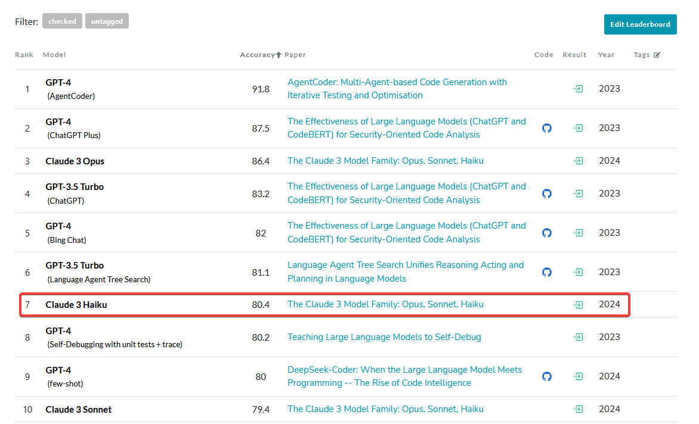

# ppxity

ppxity is a command-line tool that allows you to interact with the [Perplexity Labs (unofficial) API](https://labs.perplexity.ai/). It enables you to provide a prompt, along with a set of directories and files, and the tool will compile the content of those files into the prompt and send it to the Perplexity API.
 By default, it uses the new claude-3-haiku-20240307 model.
### Why Claude 3 Haiku as default?
Firstly, it's free on [labs.perplexity.ai](https://labs.perplexity.ai) (shoutout), and secondly the benchmarking results seem to be good.


### Features
* Input Directories
* Input Files
* Backtrack

### Information
This was made for personal use within a few hours, it's far from perfect, it doesn't have a fancy ui yet but I might add that sometime.

I simply wanted to be able to give claude3 a bunch of files before asking a question for better responses.

### Usage
```bash
Usage:
  ppxity [flags]

Examples:
ppxity -d C:\Users\User\GolandProjects\exampleProject -p "Explain what this project is about."

Flags:
  -D, --debug                 Enable debug mode
  -d, --directories strings   Directories to use for the initial prompt
  -e, --extensions strings    Allowed file extensions to use for the initial prompt (default [go,txt,mod,cs,c,rs,js,ts])
  -f, --files strings         Files to use for the initial prompt
  -h, --help                  help for ppxity
  -m, --model string          Perplexity model to use: e.g. 'claude-3-haiku-20240307' (sonar-small-online, sonar-medium-online, sonar-small-chat, sonar-medium-chat, claude-3-haiku-20240307, codellama-70b-instruct, mistral-7b-instruct, llava-v1.5-7b-wrapper, llava-v1.6-34b, mixtral-8x7b-instruct, mistral-medium, gemma-2b-it, gemma-7b-it, related) (default "claude-3-haiku-20240307")
  -p, --prompt string         Initial prompt for the conversation: e.g. 'Hello, World!'
  -s, --show-initial-prompt   Show the initial prompt
  -t, --timeout int           Timeout in seconds for receiving messages (default 50)
```

### Example use

```bash
git clone https://github.com/0xInception/ppxity
go run main.go -p "What is this project about?" -d /path/to/directory
```
or
```bash
ppxity.exe -p "What is this project about?" -d C:\path\to\directory -f C:\path\to\file.go -f C:\path\to\another\file.go
```

### License
MIT
